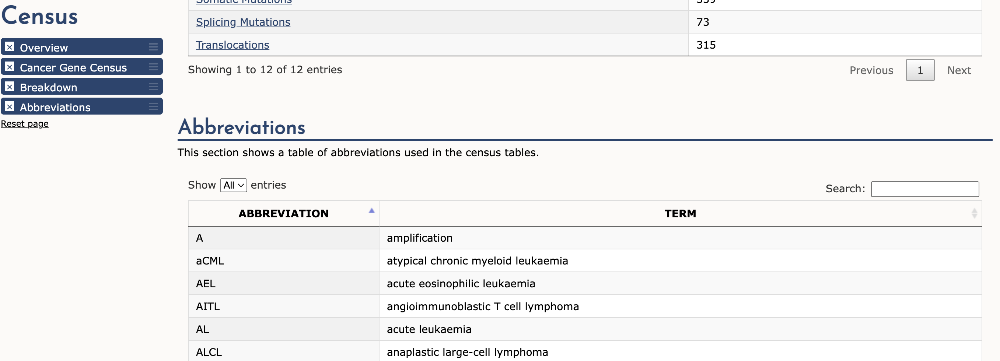

# COSMIC Cancer Database: Cancer Gene Consensus (CGC)

The Catalogue of Somatic Mutations in Cancer (COSMIC) database contains a well-curated list of genes whose mutations are associated with different cancers.  This folder processes the downloaded CGC file into a format that can be used for graphlet clustering.

### 1. Get the CGC File

Go to the [GCG Website](https://cancer.sanger.ac.uk/census) and download the `.csv` file that includes both tiers of annoataions (Tier 1 & Tier 2). Note that you must make an account in order to download this file for academic purposes. The file should be named `cancer_gene_census.csv` and placed in this directory.

_The file used for experiments was downloaded on Sept 16, 2022._

The `abbrevs.txt` file is copied from the website and parsed within the Python script:



### 2. Process the CGC File

The `csv` module is required.

```
python process_cgc.py
```

The output files include: `CGC_tier1.out`,`CGC_tier2.out`, and `CGC_bothtiers.out`. They are in the same format as the SNAP dataset.

The output file `cancer_ids.txt` maps the cancer ID to the (non-abbreviated) cancer name.

### TODOs

- Filter cancer types that have very few genes.

```
cut -f 2 CGC_bothtiers.out | sort | uniq -c | sort -grk1

39 acute myeloid leukaemia
19 T-cell acute lymphoblastic leukaemia
14 prostate
12 acute lymphocytic leukaemia
11 non-Hodgkin lymphoma
11 melanoma
 9 acute leukaemia
 9 Spitzoid tumour
 8 non small cell lung cancer
 8 colorectal
 7 papillary thyroid
 7 multiple myeloma
 7 diffuse large B-cell lymphoma
 7 anaplastic large-cell lymphoma
 6 acute myeloid leukaemia (primarily treatment associated)
 5 synovial sarcoma
 5 lung cancer
 5 glioma
 5 breast
 5 aneurysmal bone cyst
   ...
```
